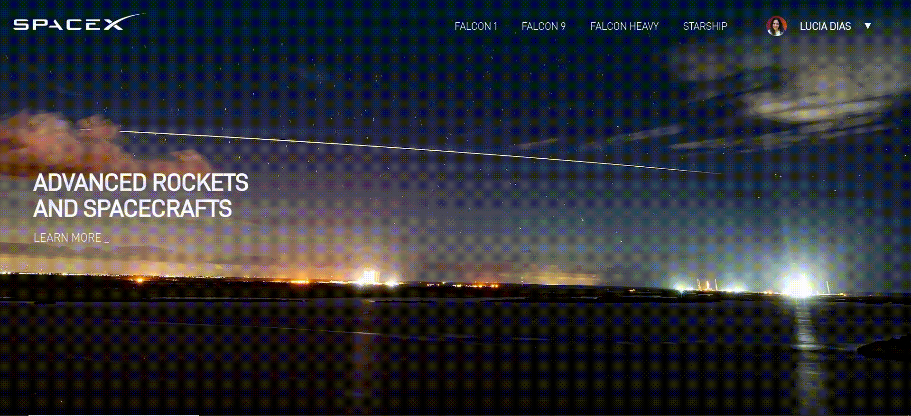

<a id="readme-top"></a>
<br />

<div align="center">
  
   <br/>
   <br/>
  <br/>
  <div>
    
    
    
    
  </div>
    <br/>
    <br/>
</div>

<p align="center">
  
</p>

## 🔎 About

This website was developed using React + TypeScript + Auth0 + Apollo GraphQL.

Utilizes the SpaceX API, allowing users to log in and access information about the rockets The core aim of its creation was to practice using Apollo GraphQL to consume the API and implement Auth0 for JWT authentication.

## 🚀 Ejecution

Steps to install and run the project:

1. Clone the project
   ```sh
   git clone https://github.com/diaslucia/spacex.git
   ```
2. Open your current directory project
   ```sh
   cd spacex
   ```
3. Install the libraries
   ```sh
   npm install
   ```
4. Create an `.env` file to enter your AUth0 keys
   ```js
   VITE_DOMAIN = "";
   VITE_KEY = "";
   ```
5. Ejecute the app

   ```sh
   npm run start
   ```

## 📂 Structure

The file structure is:

- assets: to store images and local fonts.
- components-reusable: to store reusable and layout components.
- hooks: to store apollo hook.
- utils: to store typescript types and theme from sass.
- pages: to store pages structure and their components.

<p align="right">(<a href="#readme-top">to Top</a>)</p>
